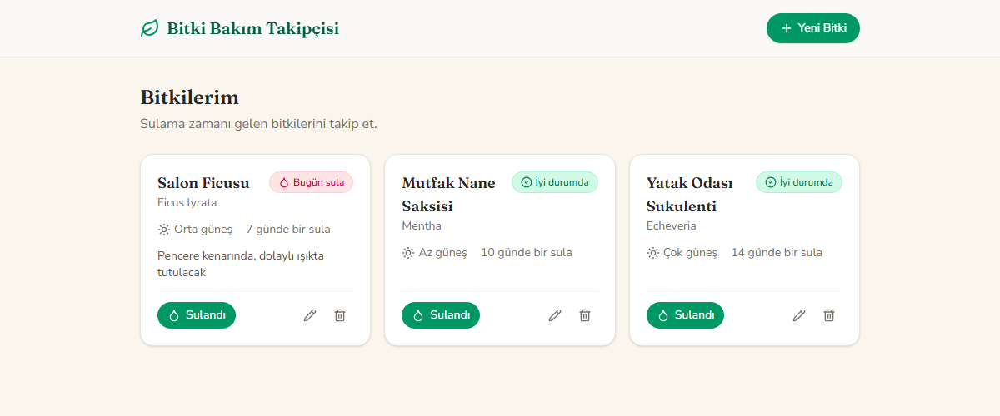

# 🌿 Bitki Bakım Takipçisi

Sahip olduğun bitkileri ekleyip sulama takvimini takip etmeni sağlayan bir Next.js uygulaması.

Uygulama bir kart listesi değil, **bir bahçe kesiti**: gökyüzünün altında bir çim şeridi, altında toprak, ve bitkiler ektiğin sırayla o toprakta duruyor — en eski bitki en uzun, en yeni bitki en küçük. Her bitkinin sulama durumu (son sulama tarihi + sulama aralığı) yaprak renginden ve rozetinden anlaşılıyor. Veriler tarayıcının `localStorage`'ında saklanıyor, backend yok.



## Özellikler

- **Ekle** — Boş toprağa dokunup tohum ekiyorsun; form dokunduğun noktadan büyüyerek açılıyor
- **Listele** — Bitkiler bahçede duruyor; tabeladaki bahçe adına tıklayınca tüm bitkilerin özet tablosu açılıyor (Bitki / Ekilme / Son sulama / Sıradaki sulama)
- **Güncelle** — Bitkiye dokununca iki hızlı işlem çıkıyor: mavi damla (hemen sula) ve kalem (düzenle)
- **Sil** — Düzenleme formunda, satır içi "emin misin?" onayıyla

### Bunlara ek olarak

- **Sulama durumu türetmesi** — `sulama aralığı - son sulamadan bu yana geçen gün` hesabıyla *gecikti / yakında / iyi durumda*. Uygulamanın var olma sebebi bu; renk tek başına asla taşımıyor, ikon ve metin de tekrar ediyor.
- **Sulama zamanı gelen bitkiyi gösteren ok** — Sulanması gereken bitkinin üstünde su mavisi bir ok zıplıyor
- **Sulama animasyonu** — Damlalar gövdeye düşüyor, ardından su köklere doğru iniyor
- **Günün saati** — Gökyüzü sabah / öğle / akşam / gece olarak değişiyor; saate göre otomatik seçiliyor, güneşe (gece: aya) tıklayarak da değiştirilebiliyor
- **Bahçe adı** — Tabeladaki isim düzenlenebilir ve kaydediliyor
- **Demo bahçe** — İlk açılışta 5 örnek bitki geliyor (ikisi bugün sulanmalı, biri yarın, biri 2 gün sonra, biri yeni ekilmiş). Bahçeye bir kez dokunduktan sonra bir daha gelmiyor; hepsini silersen boş kalıyor.

## Kullanılan Teknolojiler

- [Next.js](https://nextjs.org) 16 (App Router, TypeScript)
- [Tailwind CSS](https://tailwindcss.com) v4
- [framer-motion](https://motion.dev) — sahne ve modal animasyonları
- [lucide-react](https://lucide.dev) — ikonlar
- `localStorage` — veri kalıcılığı (backend, hesap veya senkronizasyon yok)

## Proje Yapısı

```
src/
  app/
    page.tsx            # Tek sayfa — bahçe sahnesini render eder
    icon.svg            # Sekme simgesi
    globals.css         # Tasarım token'ları (renk, tipografi) + özel kontroller
  components/
    GardenScene.tsx     # Sahne: gökyüzü, çim, toprak, bitki sırası, modal yönetimi
    GardenSign.tsx      # Asılı tabela: bahçe adı + özet tablosu
    GardenSun.tsx       # Güneş / hilal ay — günün saatini değiştiren kontrol
    PlantStem.tsx       # Bitki çizimi (3 şablon), durum rozeti, kökler, sulama animasyonu
    SeedMound.tsx       # Sıranın sonundaki tohum höyüğü ("Yeni bitki")
    PlantModal.tsx      # Ekle/düzenle formu (dokunulan noktadan büyüyerek açılır)
    PlantQuickActions.tsx  # Bitkiye dokununca çıkan sula/düzenle işlemleri
    DatePicker.tsx      # Takvim popover'ı
    SunlightPicker.tsx  # Güneş ihtiyacı seçici (az / orta / çok)
  interfaces/
    Plant.ts            # Plant ve WateringStatus tipleri
  lib/
    usePlants.ts        # localStorage tabanlı CRUD + demo bahçe
    useGardenName.ts    # Bahçe adının kalıcılığı
    plantStatus.ts      # Sulama durumu hesabı
    layoutJitter.ts     # Bitki başına deterministik konum/boy varyasyonu
```

## Kurulum

```bash
npm install
npm run dev
```

Ardından [http://localhost:3000](http://localhost:3000) adresini aç.

```bash
npm run build   # production derlemesi
npm run lint    # ESLint
```

## Yayınlama

- **GitHub:** <https://github.com/RominaDehghani/plant-care-tracker>
- **Canlı demo (Vercel):** <https://plant-care-tracker-mu.vercel.app/>

Vercel'e almak için: [vercel.com/new](https://vercel.com/new) üzerinden bu GitHub reposunu import et — `next build` ayarları otomatik algılanır, ekstra yapılandırma gerekmez.
